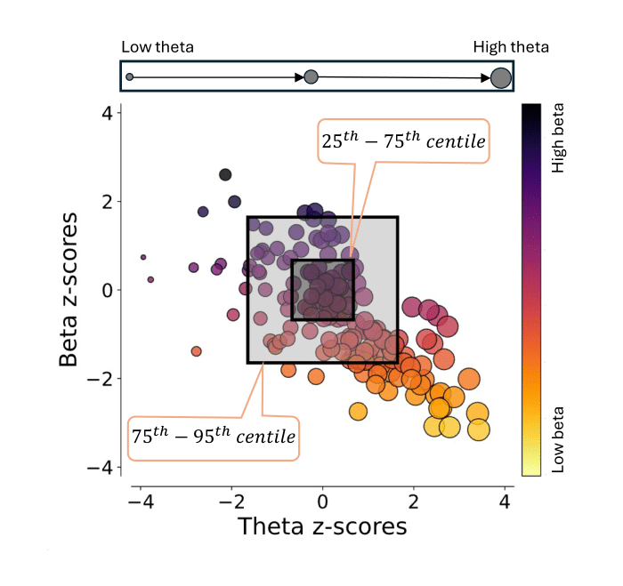

# 🧠 MEGaNorm: Normative Modeling of MEG Brain Oscillations Across the Human Lifespan

This repository provides scripts to reproduce the main analyses and figures in the paper _"Normative Modeling of MEG Brain Oscillations Across the Human Lifespan"_.

### 📄 Authors

- **Mohammad Zamanzadeh**¹  
- **Ymke Verduyn**¹  
- **Augustijn de Boer**²  
- **Tomas Ros**³  
- **Thomas Wolfers**⁴  
- **Richard Dinga**¹  
- **Marie Šafář Postma**¹  
- **Andre F. Marquand**²⁵  
- **Marijn van Wingerden**¹  
- **Seyed Mostafa Kia**¹²⁶  

---

### 📍 Affiliations

¹ Department of Cognitive Science and Artificial Intelligence, Tilburg University, Tilburg, the Netherlands  
² Donders Institute for Cognition, Brain and Behavior, Radboud University, Nijmegen, the Netherlands  
³ CIBM Center for Biomedical Imaging, University of Geneva, Geneva, Switzerland  
⁴ German Center for Mental Health, University of Tübingen, Tübingen, Germany  
⁵ Department of Cognitive Neuroscience, Radboud University Medical Center, Nijmegen, the Netherlands  
⁶ Department of Psychiatry, UMC Utrecht Brain Center, University Medical Center, Utrecht, the Netherlands  

---

## Project Overview

Normative modeling has recently been put forward to characterize heterogeneity within cohorts with neuropsychiatric disorders and enable individual-level analysis. Despite their popularity, normative models of magnetoencephalography (MEG)-based functional neuroimaging-derived phenotypes (f-IDPs) are still lacking. In this project, we utilized the [**MEGaNorm**](https://pypi.org/project/meganorm/) and [**PCNToolkit**](https://pypi.org/project/pcntoolkit/) to derive normative models for f-IDPs of resting-state MEG (rs-MEG) recordings for the first time. The models were trained on a large (1,846 participants), lifespan-spanning (ages 6–88), multi-site (6 scanner sites) dataset using hierarchical Bayesian regression (HBR) with a Sinh-Arcsinh (SHASH) likelihood. We incorporated age as a covariate, and sex and acquisition site as grouping effects. These normative ranges can support treatment outcome evaluation, subtyping, and diagnosis. The normative models retain individual variation and provide individual-level participant profiles.

### Steps:

- We first preprocessed the recordings and isolated periodic activity in the power spectrum. Features (relative theta, alpha, beta, and gamma power) were extracted and averaged across sensors.  
  

- We compared two HBR models: **Non-linear, heteroscedastic, and non-Gaussian**, and **Linear, homoscedastic, and Gaussian**, using a range of model diagnostics. Our results showed better performance for the non-linear, heteroscedastic, and non-Gaussian model.

- To demonstrate clinical application, we used deviation scores to distinguish Parkinson’s disease (PD) patients from healthy participants. We reported AUC scores across f-IDPs by running the models 10 times on different train-test splits. Extreme deviation statistics showed higher positive deviations (Z > 2) in theta and negative deviations (Z < –2) in beta in PD patients compared to controls.  
  

- Furthermore, we introduced a dimensional approach to characterize heterogeneity across PD patients, treating abnormalities as a spectrum rather than categorical distinctions.  
<p align="center">
  
</p>


- To support individual-level interpretation, we developed **Individual-level Neuro-Oscillo Charts (I-NOCs)**—visual tools that quantify and display individual deviations, enabling personalized assessment of functional brain dynamics.  
  

---

## Datasets Used

The analysis is based on 1,846 resting-state MEG recordings from clinically undiagnosed participants, pooled from six distinct datasets:

1. **Cambridge Centre for Ageing and Neuroscience (Cam-CAN)**  
   [Taylor et al., 2017](https://doi.org/10.1016/j.neuroimage.2015.09.018)

2. **Boys Town National Research Hospital (BTH)**  
   [Rempe et al., 2023](https://doi.org/10.1073/pnas.2212776120)

3. **The Open MEG Archive (OMEGA)**  
   [Niso et al., 2016](10.1016/j.neuroimage.2015.04.028)

4. **The Human Connectome Project (HCP)**  
   [Van Essen et al., 2012](10.1016/j.neuroimage.2012.02.018)

5. **National Institutes of Mental Health (NIMH)**  
   [Nugent et al., 2022](https://doi.org/10.1038/s41597-022-01623-9)

6. **Mother Of Unification Studies (MOUS)**  
   [Schoffelen et al., 2019](https://doi.org/10.1038/s41597-019-0020-y)

---

## Installation

## 🛠️ Installation of MEGaNorm package

### Option 1: Install from PyPI (Recommended)

```bash
# 1. Create and activate the environment
conda create --channel=conda-forge --strict-channel-priority --name mne python=3.12 mne
conda activate mne

# 2. Install MEGaNorm
pip install meganorm==0.1.0
```

### Option 2: Install from Source
```bash
# 1. Create and activate the environment
conda create --channel=conda-forge --strict-channel-priority --name mne python=3.12 mne
conda activate mne

# 2. Clone the repository and install MEGaNorm
git clone https://github.com/ML4PNP/MEGaNorm.git
cd MEGaNorm/
git checkout tags/v0.1.0
pip install .
```

### Clone the repository
#### Using SSH
```bash   
git clone git@github.com:ML4PNP/MEG_Norm.git
```
#### Using https
```bash
git clone https://github.com/ML4PNP/MEG_Norm.git
```

## 🚀 Running Options

### Sequential Execution
Use the MEG_Norm_sequential.ipynb notebook to run the pipeline sequentially. Note that this may take considerable time due to computational complexity.

### Parallel Execution
Use MEG_Norm_parallel.ipynb to run steps in parallel. This notebook uses SLURM for job scheduling.

## Reproducing figures
All figures in the paper can be reproduced by running figures_replication_code.ipynb. The required data are provided in the data folder, which contains numerical source data for each graph.


## References
Mohammad Zamanzadeh and Seyed Mostafa Kia. ML4PNP/MGaNorm: First public release, May 2025. URL https://doi.org/10.5281/zenodo.15441320.

## 📜 License
This project is licensed under the terms of the GNU General Public License v3.0